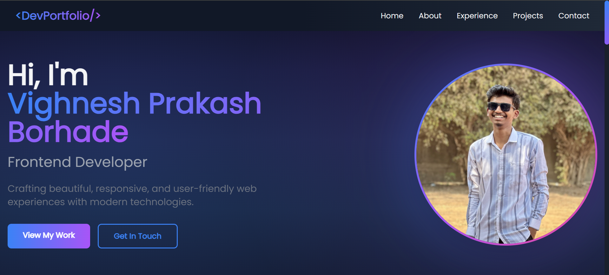
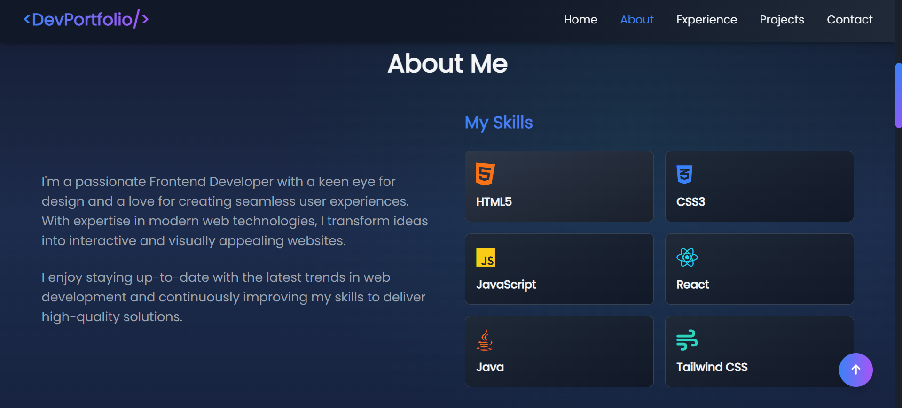
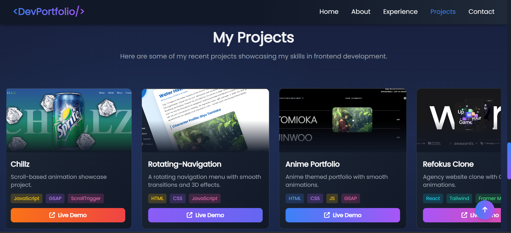
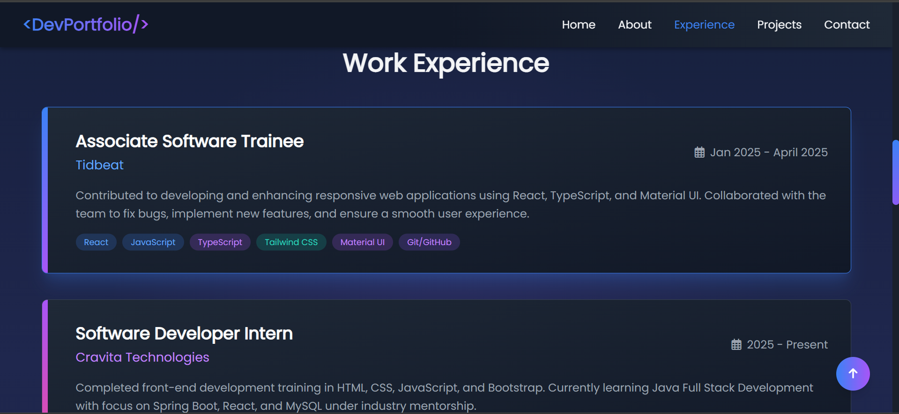
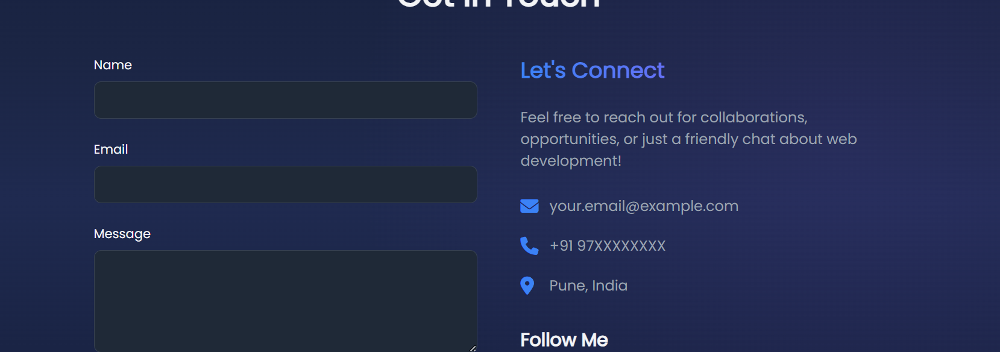
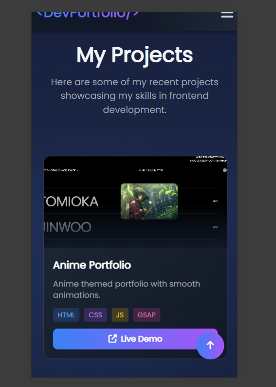

# 💼 Frontend Developer Portfolio

A modern, responsive portfolio website showcasing my work and skills as a Frontend Developer.

## 🛠️ Tech Stack


## ✨ Features

- 📱 Fully Responsive Design
- 🎨 Modern UI with Smooth Animations
- 💼 Project Showcase Section
- 📧 Contact Form
- 🌙 Dark Theme Interface

## 📸 Screenshots

### Home View


### About Section


### Projects Section


### Experience Section


### Contact Section


### Mobile View
<p align="center">
  
</p>

## 🚀 Quick Start

```bash
# Clone the repository
git clone 

# Navigate to directory
cd portfolio

# Open index.html in your browser
```

## 📝 Customization

1. Update personal info in `index.html`
2. Replace profile image and screenshots
3. Add your projects and experience
4. Customize colors in `style.css`

## 👨‍💻 Author

**Vighnesh Prakash Borhade**

[](https://github.com/vighnesh204)
<!-- [](https://linkedin.com/in/yourprofile) -->

## 📄 Usage

Feel free to use this code as inspiration or a template for your own portfolio. Please remember to:
- Replace the profile photo with your own
- Update all personal information
- Add your own projects and content

---
